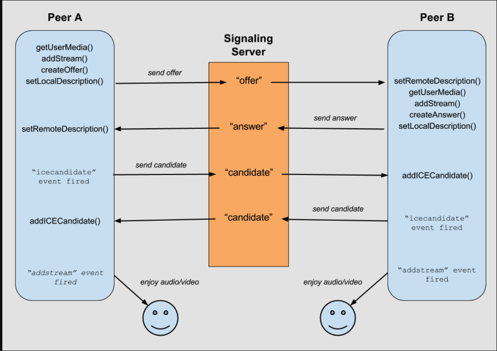

# Noom

Zoom clone using NodeJS, WebRTC and Websockets

- install nodemon

```
npm i nodemon -D
```

### sever 구동

```
server.js 는 백엔드 역할은 한다.

// http 와 ws 프로토콜을 동시에 여는 작업을 하고
const server = http.createServer(app);
const wss = new WebSocket.Server({ server });

wss.on을 통해 브라우저가 연결될때마다 작동 시킨다.
```

### socket 이벤트

```
# message
서버에서 메세지를 받을때 또는 브라우저에서 메세지를 받을때

# open
소캣이 연결되었을때

# close
연결이 끊길때

```

### socket IO

```
# 역할
framework로 실시간, 양방향, event 기반의 통신을 가능하게 함 (websocket을 이용)

SocketIO는 websocket의 부가기능이 아니다. websocket을 사용하는것. 만약 websocket이 지원이 안되면 다른것을 사용한다.

# 설치
npm install socket.io

# socket.io 열기
const io = SocketIO(server);
```

### socket.io Admin

```
npm i @socket.io/admin-ui
```


### 비디오 연동

```
https://developer.mozilla.org/en-US/docs/Web/API/MediaDevices/getUserMedia

// 유저의 카메라와 오디오를 가져옴
navigator.mediaDevices.getUserMedia();

1. 비디오 켜기
    try {
        myStream = await navigator.mediaDevices.getUserMedia(
            {
                audio: true,
                video: true,
            }
        );
        myFace.srcObject = myStream;
        console.log(myStream);
    } 
    catch(e) {
        console.log(e);
    }

2. 마이크 온 오프
    myStream.getAudioTracks().forEach(track => track.enabled = !track.enabled);

3. 카메라 온 오프
    myStream.getVideoTracks().forEach(track => track.enabled = !track.enabled);

4. 카메라 후면 전면 전환
    getUserMedia(constraints) 제약 조건을 지정
    {
        audio: true,
        // 셀피 모드
        video: { facingMode: "user" },
    }        

// 모든 장치와 미디어 장치를 가져옴 (컴퓨터와 모바일이 가지고 있는 모든 장치 정보)
await navigator.mediaDevices.enumerateDevices();

```

### WebRTC



```
# peer-to-peer는 서버를 통하지 않고 직접 전달됨. 따라서 속도가 빠름

signaling을 통해 서로의 위치, settings, configuration 등을 알려준뒤 peer-to-peer통신이 가능해짐
```

### 모바일 환경

```
# local tunnel 설치
$ npm i localtunnel
$ npx lt --port 3000

# STUN server
- 컴퓨터가 공용 IP주소를 찾게 해준다.
- 어떤것을 request하면 인터넷에서 내가 누군지 알려주는 서버

GOOGLE에서 제공해주는 stun server
    iceServers: [
        {
            urls: [
                "stun:stun.l.google.com:19302",
                "stun:stun1.l.google.com:19302",
                "stun:stun2.l.google.com:19302",
                "stun:stun3.l.google.com:19302",
                "stun:stun4.l.google.com:19302",
            ],
        }
    ]

만약 WebRTC를 활용하여 무언갈 만들려면 직접 STUN server를 구축해야 나의 공용주소를 제공할 수 있다.
```

### Data Channel
```
- 이미지, 파일, 텍스트, 게임 업데이트 패킷 갓틍ㄴ 것들을 서로 주고 받을 수 있다.
```